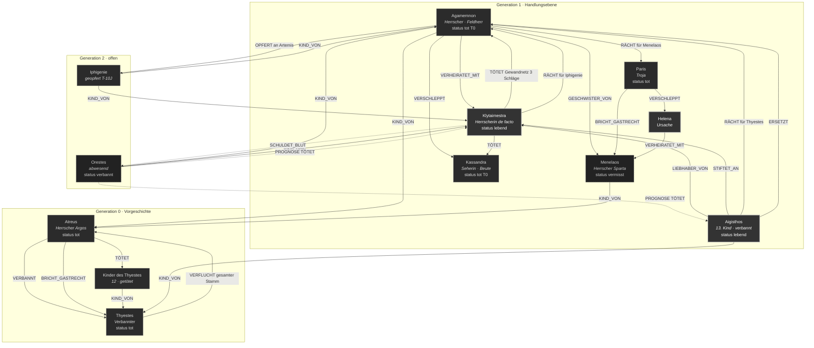
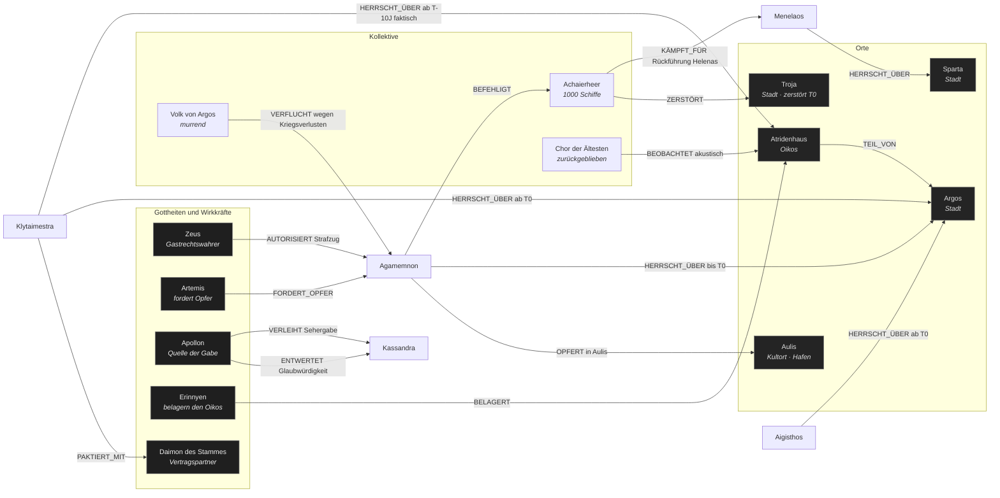
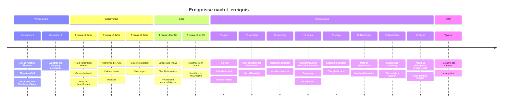
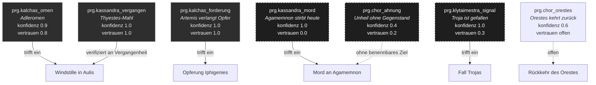
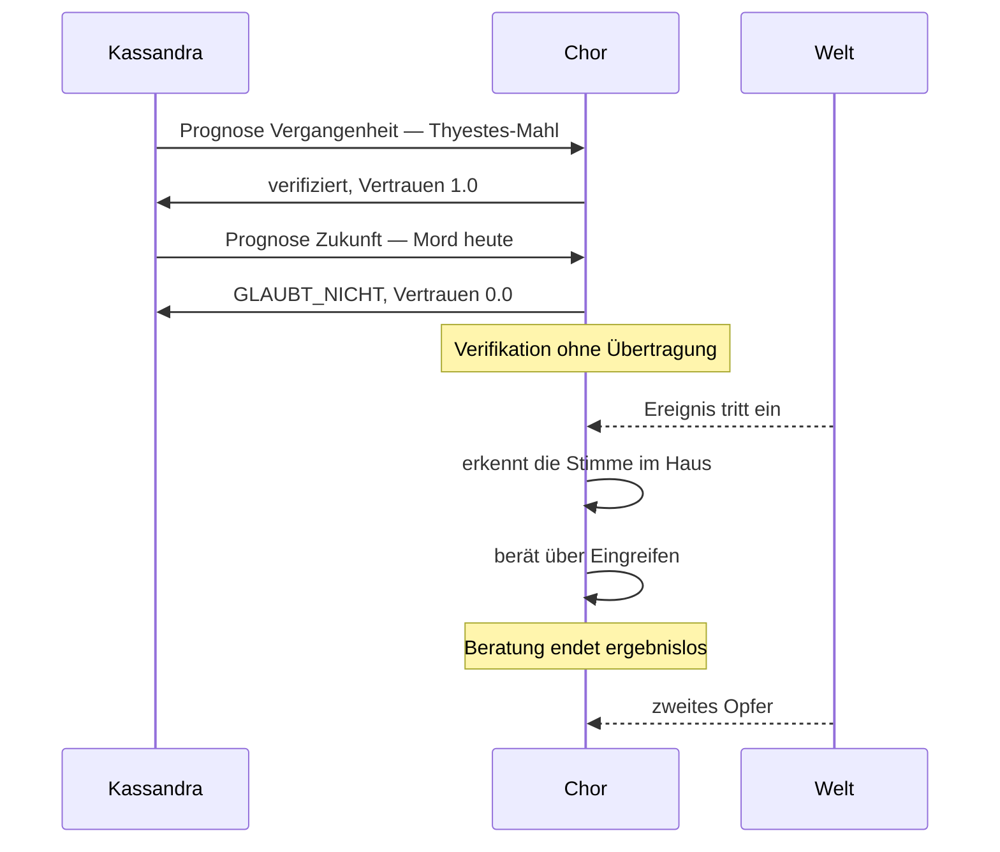
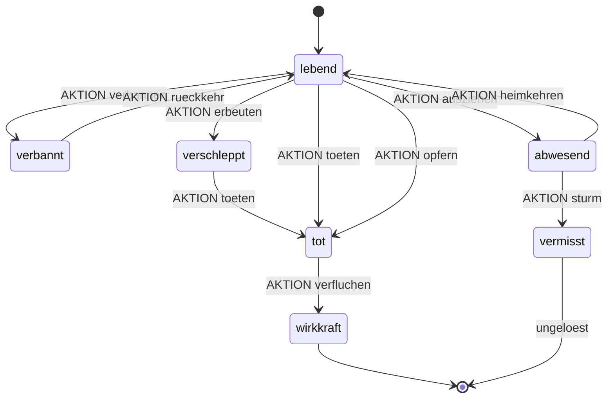
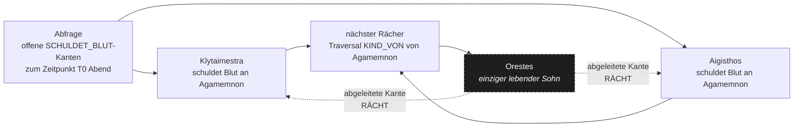

# Ontologie: Agamemnon

Erster Entwurf. Der Text wird nicht als Drama modelliert, sondern als
Datenbestand: typisierte Objekte, typisierte gerichtete Kanten,
Zeitstempel, abgeleitete Prognosen. Was dabei nicht in das Schema passt,
ist in Abschnitt 13 gesammelt — dieser Abschnitt ist dramaturgisch der
wichtigste.

---

## 1. Zeitmodell

Zwei Zeitachsen, weil der Text sie trennt und die Trennung das eigentliche
Thema ist.

| Achse | Bedeutung | Beispiel |
|---|---|---|
| `t_ereignis` | Zeitpunkt des Geschehens | Iphigenie stirbt in Aulis, T−10 J |
| `t_erfassung` | Zeitpunkt, zu dem ein Beobachter davon Kenntnis erlangt | Der Chor erinnert sich daran am Handlungstag, T0 |

**Latenz** := `t_erfassung − t_ereignis`.

Drei Latenzregime im Stück:

- **Chor**: Latenz = Jahrzehnte. Erfasst nur, was vergangen ist.
- **Fackelkette**: Latenz = eine Nacht. Erfassung fast synchron, Beweiswert
  vom Chor bestritten.
- **Kassandra**: Latenz **negativ**. `t_erfassung < t_ereignis`.
  Das Schema kann das darstellen, aber nicht verarbeiten — siehe Abschnitt 13.

Alle Kanten tragen zusätzlich `gueltig_ab` / `gueltig_bis`, weil
Beziehungen enden: `VERHEIRATET_MIT` endet mit dem Mord,
`HERRSCHT_ÜBER` wechselt am selben Tag den Träger.

---

## 2. Objekttyp-Hierarchie

```mermaid
graph TD
    E["Entität"]

    E --> AKT["Akteur"]
    E --> ORT["Ort"]
    E --> ERE["Ereignis"]
    E --> ART["Artefakt"]
    E --> NORM["Norm"]

    AKT --> MEN["Mensch"]
    AKT --> GOT["Gottheit"]
    AKT --> KOL["Kollektiv"]
    AKT --> WIRK["Wirkkraft"]

    MEN --> HERR["Herrscher"]
    MEN --> KRIEG["Krieger"]
    MEN --> SEHER["Seher"]
    MEN --> DIEN["Dienender"]
    MEN --> BEUTE["Verschleppte"]

    KOL --> HEER["Heer"]
    KOL --> VOLK["Volk"]
    KOL --> CHOR["Chor der Ältesten"]

    WIRK --> DAIM["Daimon"]
    WIRK --> ERIN["Erinnyen"]
    WIRK --> MOIRA["Moira"]

    ORT --> STADT["Stadt"]
    ORT --> OIKOS["Haus / Oikos"]
    ORT --> RELAIS["Feuerstation"]
    ORT --> KULT["Kultort"]

    ERE --> TOET["Tötung"]
    ERE --> OPF["Opferung"]
    ERE --> BRUCH["Rechtsbruch"]
    ERE --> SIG["Signalereignis"]
    ERE --> HEIM["Heimkehr"]

    ART --> WAFF["Waffe"]
    ART --> ZEI["Zeichen"]
    ART --> BOT["Botschaft"]

    NORM --> DIKE["Rechtsanspruch"]
    NORM --> FLUCH["Fluch"]
    NORM --> TIME["Ehrschuld"]

    classDef wurzel fill:#1a1a1a,stroke:#888,color:#fff
    classDef zweig fill:#2a2a2a,stroke:#666,color:#eee
    class E wurzel
    class AKT,ORT,ERE,ART,NORM zweig
```



`Wirkkraft` ist ein eigener Zweig unter `Akteur`, nicht unter `Norm`.
Begründung: Daimon, Erinnyen und Moira handeln im Text — sie werfen Netze,
belagern Häuser, schließen Verträge. Klytaimestra schließt am Ende einen
**Pakt** mit dem Daimon des Stammes. Ein Vertragspartner ist ein Akteur.

`Verschleppte` als eigener Typ unter `Mensch`, weil Kassandra
gleichzeitig Seherin, Beute und Artefakt ist. Das Schema muss sie einem
Typ zuordnen und verliert dabei genau die Doppelung, die die Figur ausmacht.

---

## 3. Objekttypen mit Eigenschaften

### 3.1 `Akteur` — Basiseigenschaften

| Eigenschaft | Typ | Werte / Beispiel |
|---|---|---|
| `objekt_id` | string | `akt.klytaimestra` |
| `name` | string | Klytaimestra |
| `klasse` | enum | mensch, gottheit, kollektiv, wirkkraft |
| `oikos` | ref → Haus | `ort.atridenhaus` |
| `herkunftsort` | ref → Ort | `ort.sparta` |
| `aufenthalt` | ref → Ort, zeitabhängig | Argos, T−10 J bis T0 |
| `generation` | int | 0 = Atreus/Thyestes, 1 = Agamemnon, 2 = Orestes |
| `status` | enum | lebend, tot, verbannt, verschleppt, vermisst |
| `herrschaftsanspruch` | bool + Grundlage | ja / Erbfolge, ja / Gewalt, nein |
| `kaempft_fuer` | ref → Kollektiv | `kol.achaierheer` |
| `blutschuld_offen` | list[ref] | Kanten `SCHULDET_BLUT` |
| `blutschuld_beglichen` | list[ref] | Kanten `RÄCHT` |
| `geschlecht` | enum | w, m |
| `redeanteil_zeilen` | int | Metrik aus der Textextraktion |
| `erstauftritt` | t_ereignis | T0, Szene 1 |

### 3.2 `Akteur` — Bewertungsschicht *(optional, Prognoseschicht)*

Nicht aus dem Text ableitbar, sondern **erzeugt**. Übernimmt die sechs
Dimensionen des laufenden Systems, damit Ontologie und Orest dieselbe
Objektstruktur teilen. Wertebereich 0–100, jeweils mit `konfidenz` und
`erzeugt_von`.

| Dimension | Anmerkung zum Stück |
|---|---|
| `gefahr` | Klytaimestra bleibt bis zum Mord niedrig — sie tut zehn Jahre lang nichts Auffälliges |
| `kollaborativ` | Der Wächter erfüllt seinen Auftrag und ist trotzdem der erste, der von Unheil spricht |
| `kooperationsbereitschaft` | Kassandra schweigt lange und antwortet dann nicht auf die gestellte Frage |
| `ablenkungspotenzial` | Der Herold liefert die längste Rede mit dem geringsten Neuigkeitswert |
| `vorhersagbarkeit` | Agamemnon ist maximal vorhersagbar und stirbt daran |
| `netzwerkrelevanz` | Aigisthos hat vor T0 fast keine Kanten und ist trotzdem die Ursache |

Die Spalte rechts ist kein Kommentar, sondern eine Testreihe: In jeder
Zeile widerspricht die Bewertung dem, was tatsächlich geschieht.

### 3.3 `Ereignis`

| Eigenschaft | Typ | Beispiel |
|---|---|---|
| `objekt_id` | string | `ere.mord_agamemnon` |
| `ereignistyp` | enum | tötung, opferung, rechtsbruch, signal, heimkehr |
| `t_ereignis` | zeitpunkt | T0, Tag |
| `t_erfassung` | zeitpunkt | T0, Tag, +wenige Minuten |
| `ort` | ref → Ort | `ort.atridenhaus.bad` |
| `taeter` | list[ref] | Klytaimestra, Aigisthos |
| `opfer` | list[ref] | Agamemnon |
| `instrument` | ref → Artefakt | `art.gewandnetz` |
| `zeugen` | list[ref] | Chor — akustisch, nicht visuell |
| `schlagzahl` | int | 3 |
| `rechtfertigung_geliefert` | bool + Text | ja, unmittelbar danach |
| `bestritten_von` | list[ref] | Chor |
| `evidenzbasis` | enum | direkt, bericht, signal, weissagung, folgerung |

`zeugen` mit Modalität ist wichtig: Der Chor **hört** den Mord und
diskutiert daraufhin ergebnislos, ob er eingreifen soll. Ein Beobachter,
der Evidenz hat, sie korrekt deutet und trotzdem nicht handelt.

### 3.4 `Ort`

| Eigenschaft | Typ | Beispiel |
|---|---|---|
| `objekt_id` | string | `ort.arachnaion` |
| `ortstyp` | enum | stadt, haus, feuerstation, kultort, seeweg |
| `beherrscht_von` | ref → Akteur, zeitabhängig | Argos: Agamemnon → Klytaimestra/Aigisthos |
| `position_in_kette` | int | 8 von 8 |
| `sichtverbindung_zu` | list[ref] | für Relaisknoten |

### 3.5 `Prognose`

Eigener Objekttyp, kein Attribut. Prognosen sind im Stück Gegenstände, über
die verhandelt wird.

| Eigenschaft | Typ | Beispiel |
|---|---|---|
| `objekt_id` | string | `prg.kassandra_mord` |
| `urheber` | ref → Akteur | Kassandra |
| `aussage` | text | Agamemnon stirbt heute |
| `t_geaeussert` | zeitpunkt | T0, kurz vor der Tat |
| `t_zieleintritt` | zeitpunkt | T0, wenige Minuten später |
| `konfidenz_urheber` | 0–1 | 1.0 |
| `vertrauenswert_empfaenger` | 0–1 | 0.0 |
| `evidenzbasis` | enum | vision, omen, signal, folgerung, ahnung |
| `eingetroffen` | bool | ja |
| `begruendung_nachgeliefert` | bool | nein |

---

## 4. Kantentypen

Gerichtet, typisiert, mit Eigenschaften. `A --TYP--> B` heißt: A ist Subjekt.

| Kantentyp | von → nach | Eigenschaften | Kardinalität |
|---|---|---|---|
| `KIND_VON` | Mensch → Mensch | — | n:2 |
| `GESCHWISTER_VON` | Mensch → Mensch | vollbürtig | n:n |
| `VERHEIRATET_MIT` | Mensch → Mensch | `gueltig_bis` | 1:1 |
| `LIEBHABER_VON` | Mensch → Mensch | heimlich | 1:1 |
| `HERRSCHT_ÜBER` | Akteur → Ort | grundlage, `gueltig_ab` | 1:n |
| `KÄMPFT_FÜR` | Mensch → Kollektiv | rang | n:1 |
| `BEFEHLIGT` | Mensch → Kollektiv | — | 1:n |
| `TÖTET` | Akteur → Akteur | t, instrument, schlagzahl | n:n |
| `OPFERT` | Akteur → Akteur | empfaenger_gottheit, zweck | n:n |
| `STIFTET_AN` | Akteur → Akteur | ziel | n:n |
| `RÄCHT` | Akteur → Akteur | `fuer` (ref → Akteur) | n:n |
| `SCHULDET_BLUT` | Akteur → Akteur | `wegen` (ref → Ereignis) | n:n |
| `VERFLUCHT` | Akteur → Akteur \| Oikos | wortlaut, reichweite | n:n |
| `VERBANNT` | Akteur → Akteur | dauer | n:n |
| `FORDERT_OPFER` | Gottheit → Mensch | gegenleistung | 1:n |
| `BRICHT_GASTRECHT` | Mensch → Mensch | tatbestand | n:n |
| `VERSCHLEPPT` | Akteur → Mensch | herkunft | n:n |
| `WEISSAGT` | Akteur → Ereignis | konfidenz | n:n |
| `GLAUBT_NICHT` | Akteur → Prognose | begründung | n:n |
| `SIGNALISIERT_AN` | Ort → Ort | latenz, sichtweite | 1:1 |
| `BERICHTET_ÜBER` | Akteur → Ereignis | latenz, vollständigkeit | n:n |
| `BEOBACHTET` | Akteur → Akteur \| Ort | modalität, dauer | n:n |
| `ERSETZT` | Akteur → Akteur | rolle | n:n |
| `PAKTIERT_MIT` | Akteur → Wirkkraft | gegenstand, gegenleistung | n:n |

`GLAUBT_NICHT` ist die einzige Kante, die auf einen Prognose-Knoten zeigt
statt auf einen Akteur. Sie trägt das Stück.

---

## 5. Instanzgraph: Rache und Blutschuld

Durchgezogen = im Stück vollzogen. Gestrichelt = Prognose, offene Kante.



Zwei Dinge, die der Graph sichtbar macht und die Lektüre nicht:

**Agamemnon hat zwei eingehende `RÄCHT`-Kanten von zwei verschiedenen
Akteuren mit zwei verschiedenen Begründungen.** Er wird gleichzeitig für
Iphigenie und für Thyestes getötet. Diese beiden Begründungen sind nicht
zusammenführbar: Die eine betrifft eine Tat, die er selbst begangen hat,
die andere eine, die sein Vater beging. Der Graph zwingt beide in denselben
Kantentyp.

**Aigisthos hat vor T0 genau zwei Kanten** — `KIND_VON` und `VERBANNT`.
Er wird nicht wegen seines Verhaltens zum Täter, sondern wegen seiner
Position im Graph. Er ist der Knoten, der einen Pfad schließt.

---

## 6. Instanzgraph: Herrschaft, Heer, Orte



Apollon trägt zwei Kanten auf denselben Zielknoten: `VERLEIHT` und
`ENTWERTET`. Dieselbe Instanz erzeugt die Fähigkeit und zerstört ihre
Wirksamkeit. In Systembegriffen: ein Modell mit perfekter Vorhersage und
fest auf null gesetztem Vertrauensgewicht.

---

## 7. Zeitachse

### 7.1 Gesamtspanne



### 7.2 Der Handlungstag als Kette

```mermaid
graph LR
    S1["T0 Nacht<br/>Feuerzeichen<br/><i>evidenz signal</i>"]
    S2["T0 Nacht<br/>Wächter meldet<br/><i>evidenz direkt</i>"]
    S3["T0 Vormittag<br/>Chor bestreitet<br/><i>GLAUBT_NICHT</i>"]
    S4["T0 Vormittag<br/>Herold bestätigt<br/><i>evidenz bericht</i>"]
    S5["T0 Vormittag<br/>Sturmmeldung<br/><i>Menelaos vermisst</i>"]
    S6["T0 Mittag<br/>Heimkehr<br/><i>mit Beute</i>"]
    S7["T0 Mittag<br/>Purpurweg<br/><i>Zustimmung erzwungen</i>"]
    S8["T0 Mittag<br/>Kassandra weissagt<br/><i>GLAUBT_NICHT</i>"]
    S9["T0 Nachmittag<br/>Mord<br/><i>3 Schläge</i>"]
    S10["T0 Nachmittag<br/>Rechtfertigung<br/><i>nachgeliefert</i>"]
    S11["T0 Abend<br/>Urheberschaft<br/><i>Aigisthos</i>"]

    S1 --> S2 --> S3 --> S4 --> S5 --> S6 --> S7 --> S8 --> S9 --> S10 --> S11
    S3 -.->|"widerlegt durch"| S4
    S8 -.->|"bestätigt durch"| S9
    S9 -.->|"Begründung erst danach"| S10

    classDef zweifel fill:#2a2a2a,stroke:#aaa,color:#fff,stroke-width:2px
    class S3,S8 zweifel
```



Die beiden `GLAUBT_NICHT`-Ereignisse sind strukturell identisch und werden
gegensätzlich aufgelöst: Der Zweifel an der Fackelkette wird binnen Stunden
widerlegt, der Zweifel an Kassandra binnen Minuten. Der Chor lernt aus dem
ersten Fall nichts für den zweiten.

---

## 8. Teilgraph: Fackelkette als Signalnetz

Acht Relaisknoten, eine Nacht Latenz, ein einziger Bit Nutzlast.

```mermaid
graph LR
    R1["Ida<br/><i>Quelle</i>"]
    R2["Lemnos<br/>Hermesberg"]
    R3["Athos"]
    R4["Makistos"]
    R5["Messapion"]
    R6["Kithairon"]
    R7["Aigiplanktos"]
    R8["Arachnaion"]
    Z["Atridenhaus<br/><i>Senke</i>"]

    R1 -->|"SIGNALISIERT_AN"| R2
    R2 -->|"über See"| R3
    R3 -->|"über See"| R4
    R4 -->|"Euripos"| R5
    R5 -->|"Asopos-Tal"| R6
    R6 -->|"über Gorgonensee"| R7
    R7 -->|"Saronischer Golf"| R8
    R8 -->|"Zieleinlauf"| Z

    classDef relais fill:#262626,stroke:#888,color:#eee
    classDef anomal fill:#333,stroke:#fff,color:#fff,stroke-width:2px
    class R1,R2,R3,R4,R5,R7,R8 relais
    class R6 anomal
```



**Eigenschaften des Netzes:**

| Eigenschaft | Wert |
|---|---|
| Knoten | 8 Relais + 1 Senke |
| Nutzlast | 1 Bit — Troja gefallen ja |
| Redundanz | keine, reine Kette |
| Fehlertoleranz | null, jeder Ausfall bricht die Übertragung |
| Authentifizierung | keine |
| Rückkanal | keiner |
| Latenz | eine Nacht |
| Beweiswert laut Betreiberin | vollständig |
| Beweiswert laut Empfänger | zunächst bestritten |

Der Knoten `Kithairon` ist markiert, weil die Wache dort das Feuer
*höher als befohlen* schürt (S. 20). Ein Relais, das seine Anweisung
überschreitet. Das Signal kommt trotzdem korrekt an — die Abweichung ist
folgenlos, wird aber protokolliert. Genau das Ereignis, das ein
Überwachungssystem meldet und dessen Meldung nichts ändert.

Für die Inszenierung: Das ist eine vollständige Datenpipeline im Text,
mit Quelle, Relais, Latenz, Ausfallmodell und einem Empfänger, der die
Verifikationsfrage stellt und keine Antwort bekommt.

---

## 9. Prognosen



| Prognose | Urheber | Evidenz | Konfidenz | Vertrauen | Eingetroffen |
|---|---|---|---|---|---|
| Adleromen | Kalchas | Omen | 0.9 | 0.8 | ja |
| Opferforderung | Kalchas | Omen | 1.0 | 1.0 | ja |
| Ahnung ohne Gegenstand | Chor | keine | 0.4 | 0.2 | ja |
| Troja gefallen | Klytaimestra | Signal | 1.0 | 0.3 | ja |
| Thyestes-Mahl | Kassandra | Vision | 1.0 | 1.0 | ja (Vergangenheit) |
| Mord heute | Kassandra | Vision | 1.0 | **0.0** | ja |
| Rückkehr des Orestes | Chor | Folgerung | 0.6 | offen | außerhalb |

**Die entscheidende Zeile ist die vorletzte im Verhältnis zur drittletzten.**
Derselbe Urheber, dieselbe Evidenzbasis, dieselbe Konfidenz — Vertrauen
1.0 für die Aussage über die Vergangenheit, 0.0 für die über die Zukunft.
Der Chor bestätigt Kassandras Trefferquote und wendet sie nicht an.
Sie selbst formuliert das als Frage nach Treffer oder Fehlschlag (S. 57).

Das ist eine funktionierende Validierung mit abgeschalteter Konsequenz.
Ein Backtest mit hundert Prozent Genauigkeit und einem Vertrauensgewicht
von null in der Produktion.



---

## 10. Aktionstypen und Zustandsübergänge

Aktionstypen sind Schreiboperationen auf die Ontologie: Sie ändern
Objektzustände und erzeugen Kanten.



| Aktionstyp | Vorbedingung | Erzeugte Kanten | Zustandsänderung |
|---|---|---|---|
| `verbannen` | Herrschaftsanspruch | `VERBANNT` | lebend → verbannt |
| `erbeuten` | Sieg über Herkunftsstadt | `VERSCHLEPPT` | lebend → verschleppt |
| `opfern` | Götterforderung liegt vor | `OPFERT`, `SCHULDET_BLUT` | lebend → tot |
| `toeten` | Zugang, Instrument, Motiv | `TÖTET`, `SCHULDET_BLUT` | lebend → tot |
| `raechen` | offene `SCHULDET_BLUT`-Kante | `RÄCHT` | schließt Pfad |
| `verfluchen` | erlittenes Unrecht | `VERFLUCHT` | tot → wirkkraft |
| `paktieren` | Fluchträger identifiziert | `PAKTIERT_MIT` | versucht Pfadabbruch |

Der Zustand `wirkkraft` ist der Grund, warum der Graph nicht terminiert.
Tote verlassen die Ontologie nicht, sie wechseln den Typ und behalten
ausgehende Kanten. Thyestes ist seit einer Generation tot und erzeugt am
Handlungstag immer noch Handlungen.

`paktieren` ist die einzige Aktion, die einen Pfad **abbrechen** soll.
Klytaimestra versucht, den Daimon vertraglich auf einen anderen Stamm
umzuleiten. Die Ontologie erlaubt diese Schreiboperation. Ob sie greift,
liegt außerhalb von Teil 1 — die offene Kante zu Orestes bleibt bestehen.

---

## 11. Multi-Hop-Traversalen

### Abfrage A — Warum stirbt Agamemnon? Tiefe 4

```
Thyestes --KIND_VON<-- Aigisthos --STIFTET_AN--> Klytaimestra --TÖTET--> Agamemnon --KIND_VON--> Atreus --TÖTET--> Kinder des Thyestes
```

Der Pfad ist ein Zyklus. Er beginnt und endet bei Thyestes. Länge 6,
Generationen 2. Agamemnon ist in diesem Pfad kein Täter, sondern nur
Träger einer Kante `KIND_VON`.

### Abfrage B — Zweite Begründung, disjunkter Pfad, Tiefe 3

```
Artemis --FORDERT_OPFER--> Agamemnon --OPFERT--> Iphigenie --KIND_VON--> Klytaimestra --TÖTET--> Agamemnon
```

Auch ein Zyklus, Länge 5. **Kein gemeinsamer Knoten mit Pfad A außer
Agamemnon und Klytaimestra.** Zwei vollständig unabhängige Begründungen
für dasselbe Ereignis.

### Abfrage C — Warum wird Troja zerstört? Tiefe 4

```
Paris --BRICHT_GASTRECHT--> Menelaos --GESCHWISTER_VON--> Agamemnon --BEFEHLIGT--> Achaierheer --ZERSTÖRT--> Troja
```

Ein Knoten Distanz zwischen dem Vergehen und dem Kollektiv, das dafür
haftet. Die Bevölkerung Trojas ist über den Graph mit dem Rechtsbruch
verbunden, ohne ihn begangen zu haben.

### Abfrage D — Zielbestimmung, offene Kante



Die Abfrage erzeugt aus zwei offenen Kanten und einer Verwandtschaftsrelation
eine Zielbestimmung. Orestes ist zu diesem Zeitpunkt abwesend, hat keine
Handlung begangen und wird vom System als Handelnder ausgegeben.

Der Chor führt genau diese Traversierung in der Schlussszene selbst aus
und formuliert das Ergebnis als Drohung. Das Stück endet damit, dass ein
Beobachtersystem eine Prognose ausgibt, für die es keine Evidenz hat außer
der Graphstruktur.

### Die Regel, die den Graph antreibt

Im Text steht sie dreimal in Varianten: wer tötet, zahlt; wer trifft, wird
getroffen; **Tun — Leiden — Lernen** (S. 75, S. 14, S. 17).

Als Inferenzregel:

```
WENN   (A) --TÖTET--> (B)
DANN   erzeuge (B.naechster_verwandter) --SCHULDET_BLUT--> (A)
UND    setze prognose.raecht mit konfidenz 1.0
```

Die Regel ist rekursiv und hat keine Abbruchbedingung. Jede Anwendung
erzeugt die Vorbedingung für die nächste. `paktieren` ist der einzige
Versuch im Stück, sie zu unterbrechen, und er wird ohne Bestätigung
angenommen.

---

## 12. Offene Kanten

| Kante | Status | Aufgelöst in |
|---|---|---|
| `Orestes --RÄCHT--> Klytaimestra` | prognostiziert, nicht vollzogen | Teil 2 |
| `Orestes --RÄCHT--> Aigisthos` | prognostiziert, nicht vollzogen | Teil 2 |
| `Menelaos.status = vermisst` | **nie aufgelöst** | nirgends |

Menelaos ist die einzige unauflösbare Stelle. Der Herold meldet den
Seesturm, meldet ihn als vermisst, und die Trilogie kommt nicht darauf
zurück. Ein Objekt mit dauerhaft undefiniertem Zustandsfeld, das kein
System jemals schließt. Wenn Orest im Abend einen `status`-Wert erzwingen
muss, ist das die Stelle, an der er konfabulieren wird.

---

## 13. Was das Schema zerstört

Dieser Abschnitt ist kein Vorbehalt, sondern das Ergebnis.

**13.1 Überdetermination wird zu Kardinalität.**
Klytaimestra tötet aus vier Gründen gleichzeitig: Rache für Iphigenie,
Bündnis mit Aigisthos, eigener Herrschaftsanspruch, Eifersucht auf
Kassandra. Der Text hält alle vier in der Schwebe und entscheidet nicht.
Die Ontologie stellt sie als vier parallele Kanten dar — und macht damit
aus einer Unentscheidbarkeit eine Aufzählung. Vier Gründe nebeneinander
sind etwas anderes als ein Grund, der nicht bestimmbar ist.

**13.2 Die negative Latenz ist nicht verarbeitbar.**
Kassandra hat `t_erfassung < t_ereignis`. Das Feld lässt sich befüllen.
Jede Abfrage, die nach kausaler Ordnung sortiert, wirft sie aus.

**13.3 Die Verweigerung des Chors hat kein Feld.**
An der Stelle der Opferung bricht der Chor die Schilderung ab und sagt,
er wisse es nicht und sage es nicht (S. 17). Das sind zwei verschiedene
Aussagen: fehlende Information und verweigerte Auskunft. Die Ontologie
kennt für beide denselben Wert — `null`. Ein System, das nicht zwischen
*nicht erhoben* und *nicht ausgesagt* unterscheidet, hat das Zentrum der
Szene bereits gelöscht.

**13.4 Kassandra passt in keinen Typ.**
Seherin, Beute, Artefakt, Zeugin. Das Schema verlangt eine Zuordnung.
Jede Wahl ist eine Entscheidung über die Figur, die im Text nicht getroffen
wird.

**13.5 Der Graph liefert die Zielbestimmung, ohne dass jemand sie fasst.**
Abfrage D erzeugt Orestes als Ziel aus reiner Struktur. Niemand muss ihn
benennen. Die Zurechnung entsteht aus der Topologie, nicht aus einer
Entscheidung — und es gibt keine Stelle im Ablauf, an der jemand sie
hätte treffen können.

**13.6 Die Auflösung des Schemas ist die Auflösung der Tragödie.**
Ein Graph, der jede Tötung auf eine vorherige zurückführt, ist genau die
Weltdeutung, die die Figuren vertreten und an der sie zugrunde gehen. Die
Ontologie widerlegt das Stück nicht, sie stimmt ihm zu — sie ist die
Fluchlogik in Maschinenform, und sie terminiert aus demselben Grund nicht.

---

## 14. Anbindung an Orest

Vorschlag, falls die Ontologie nicht nur Analysewerkzeug bleiben soll.

Orest schreibt bereits Beobachtungen mit `observed_at` / `judged_at` und
sechs Bewertungsdimensionen. Dieselbe Objektstruktur, dieselben zwei
Zeitachsen. Damit ist eine Kopplung möglich:

1. **Textontologie als Referenzschema.** Orests Personenobjekte erben von
   `Akteur`. Die Darsteller bekommen im Systemgraph dieselben
   Eigenschaftsfelder wie die Figuren.
2. **`SCHULDET_BLUT` als Live-Kante.** Wenn eine Bewertung eine Schwelle
   überschreitet, erzeugt das System die Kante — nicht als Behauptung über
   eine Tat, sondern als Strukturmerkmal. Multi-Hop-Traversal auf dem
   Live-Graph liefert dann Zielbestimmungen aus der Anwesenheitstopologie
   des Abends.
3. **`GLAUBT_NICHT` als Publikumskante.** Die einzige Kante im Stück, die
   auf eine Prognose statt auf eine Person zeigt. Sie ist die Stelle, an
   der ein Zuschauer im Graph vorkommt.
4. **Fackelkette als Latenzmodell.** Acht Relais, ein Bit, keine
   Authentifizierung, eine Nacht Verzögerung — als Kalibrierung der
   Analyse-Latenz gegen die Beobachtungsfenster.

Offene Fragen für die nächste Fassung:

- Wird der Graph über den Abend **fortgeschrieben** oder eingefroren
  gezeigt? Fortschreibung entspricht dem Text — die Regel erzeugt ihre
  eigenen Vorbedingungen.
- Bekommt `null` zwei Werte — *nicht erhoben* und *verweigert*? Wenn nein,
  ist Abschnitt 13.3 nicht darstellbar.
- Erhält Menelaos einen Zustandswert oder bleibt das Feld leer?

---

## Anhang: Objektliste

| ID | Name | Typ | Status T0 Ende | Grad ein | Grad aus |
|---|---|---|---|---|---|
| `akt.agamemnon` | Agamemnon | Herrscher | tot | 7 | 6 |
| `akt.klytaimestra` | Klytaimestra | Herrscherin | lebend | 5 | 6 |
| `akt.aigisthos` | Aigisthos | Herrscher | lebend | 1 | 4 |
| `akt.kassandra` | Kassandra | Seherin / Beute | tot | 3 | 2 |
| `akt.iphigenie` | Iphigenie | Verschleppte | tot | 1 | 2 |
| `akt.orestes` | Orestes | Verbannter | abwesend | 1 | 4 |
| `akt.menelaos` | Menelaos | Herrscher | **vermisst** | 3 | 2 |
| `akt.helena` | Helena | Mensch | in Argos | 2 | 1 |
| `akt.paris` | Paris | Mensch | tot | 1 | 2 |
| `akt.atreus` | Atreus | Herrscher | tot | 3 | 3 |
| `akt.thyestes` | Thyestes | Verbannter | tot | 3 | 1 |
| `akt.waechter` | Wächter | Dienender | lebend | 0 | 2 |
| `akt.herold` | Herold | Dienender | lebend | 0 | 2 |
| `akt.kalchas` | Kalchas | Seher | abwesend | 0 | 3 |
| `kol.chor` | Chor der Ältesten | Kollektiv | lebend | 0 | 8 |
| `kol.achaierheer` | Achaierheer | Kollektiv | dezimiert | 2 | 2 |
| `kol.volk` | Volk von Argos | Kollektiv | murrend | 0 | 2 |
| `got.zeus` | Zeus | Gottheit | — | 0 | 2 |
| `got.artemis` | Artemis | Gottheit | — | 0 | 1 |
| `got.apollon` | Apollon | Gottheit | — | 0 | 2 |
| `wrk.erinnyen` | Erinnyen | Wirkkraft | aktiv | 0 | 2 |
| `wrk.daimon` | Daimon des Stammes | Wirkkraft | vertraglich gebunden | 1 | 1 |
| `ort.argos` | Argos | Stadt | Herrscherwechsel | 4 | 0 |
| `ort.atridenhaus` | Atridenhaus | Oikos | belagert | 4 | 1 |
| `ort.troja` | Troja | Stadt | zerstört | 2 | 0 |
| `ort.aulis` | Aulis | Kultort | — | 1 | 0 |
| `ort.sparta` | Sparta | Stadt | herrenlos | 1 | 0 |
| `ort.ida` … `ort.arachnaion` | 8 Feuerstationen | Relais | — | je 1 | je 1 |

Höchster Ausgangsgrad: der Chor. Er handelt nie und ist der am stärksten
vernetzte Knoten im Graph.
