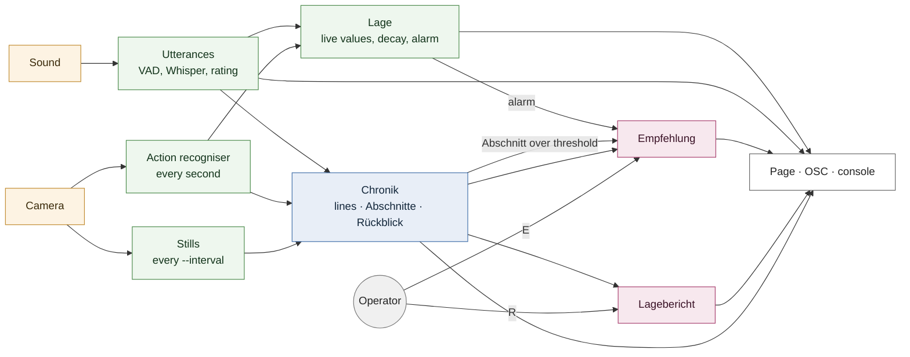

# Live SITREP: fast lane, Chronik, reports on request

Written 2026-09-29. It builds on `live_sitrep_latency.md`, whose fixes 1–5
this implements, with one change Moe asked for: **a report is made only when
the operator presses R**. So that a report still covers the last minutes and
not only the last seconds, a summary of the scene is kept in the background
as it goes on. The recommendation (Empfehlung) uses the same infrastructure.
Measurements are in `changelog.md` (2026-09-29).

## The idea

Real surveillance systems separate three speeds (`live_sitrep_latency.md`,
"How real surveillance systems do it"):

1. **Detectors and transcription run continuously** and raise alarms within a
   second. No language model sits between the room and the operator.
2. **An incident log is kept as things happen.** Operators write it by hand
   in a control room; PSIM systems keep it automatically.
3. **Heavy analysis runs on request, or when an event triggers it**, and reads
   the log instead of the raw footage.

Apollon had only the third, run every window. Now it has all three:

## Fast lane: within about a second (`utterances.py`, `lage.py`)

- **Utterances.** Silero VAD runs on the live sound chunk by chunk, carrying
  its state. The streamed probabilities equal the one-pass result exactly.
- **End of an utterance.** 0.5 s of silence ends one. So does a 0.2 s pause
  once it has run 3 s: in a quarrel speech rarely stops for 0.5 s. At 10 s it
  is cut regardless.
- **The line.** Each utterance is transcribed by Whisper, attributed by lip
  movement and measured for loudness. Its lines are shown at once, unrated.
- **The rating** follows on a thread of its own. Lines that arrive during a
  rating wait and are rated together next, with the four lines before them as
  context.
- **Live values** are worked out every 0.5 s from the recent action readings
  and rated lines, never stored. Evidence counts half after
  `lage.HALBWERTSZEIT` (20 s). Loudness amplifies Risiko as before.
- **The alarm** is a rule: a person's live Risiko, or a line of unknown
  speaker, at 3 or more. These are the spike thresholds of the latency doc.
  Lines of unknown speaker count because most lines on the corpus stay
  `(unklar)`.

## Chronik: the distillation, in the background (`chronik.py`)

Three layers, like an incident log that is consolidated as it ages:

| Layer | What | Kept |
|---|---|---|
| Lines | every rated line, word for word | until its Abschnitt is folded |
| Abschnitte | every `--window` seconds: lines, action ratings, who was present, two stills → 1–2 sentences, Eskalation and Gefahr 0–10, Tendenz (zuspitzend/gleichbleibend/beruhigend) | the last 5 min (`DETAIL`) in detail |
| Rückblick | older Abschnitte folded, 4 at a time, into ≤ 6 chronological sentences | the whole run |
| Kurve | Eskalation and Gefahr per Abschnitt | the whole run, as numbers |

- **Continuity.** Each Abschnitt is summarised with the Rückblick and the last
  three Abschnitte as context, so it can say whether the scene sharpens.
- **Bounded context.** Folding keeps a report's context the same size however
  long the run. The Kurve keeps the shape of the scene after its words are
  gone.
- **Failure.** If the model cannot summarise an Abschnitt, the Abschnitt keeps
  its lines and a report reads those instead.
- **Retention.** Everything lives in memory and is deleted when the run
  stops. Words are deleted earlier, when their Abschnitt is folded.

## On request: Lagebericht and Empfehlung (`report.py`, `session.py`)

Both read the same context: Rückblick, Abschnitte, Kurve, the live values
with their causes, the lines since the last summarised Abschnitt word for
word, and stills from the last 15 s. Both share one fixed prompt opening
(`report.QUELLEN`), so Ollama can reuse its cache.

- **Lagebericht (R).** The report as before, plus a **Verlauf**: two to three
  chronological sentences with the turning points and their times.
  3–5 s on the 5090.
- **Empfehlung.** A verdict on intervening, the scene's ratings and one
  measure; about 1.5 s. The rule (`SCHWELLE`) still decides whether to
  intervene, and the model weighs the trigger against the Chronik.
  - **Triggers:** the alarm's rising edge; an Abschnitt rated above the
    threshold; the operator (E).
  - **Pacing:** automatic ones are at least 15 s apart. A trigger during a
    running one is answered once after it.
  - `--no-auto-empfehlung` leaves it to E.
- **Priority at the model.** Ollama serves one request at a time (measured),
  so `llm.Gate` orders Apollon's requests: line ratings, then Empfehlung, then
  Lagebericht, then the Chronik.

## Measured (Four Dogs, 0–405 s, `python -m sitrep.replay`)

| Output | Measured | Target (`live_sitrep_latency.md`) |
|---|---|---|
| Line on screen after it ends | p50 0.4 s, p95 0.9 s | p95 ≤ 2.5 s |
| Line rated after it ends | p50 1.2 s, p95 2.1 s | – |
| Person value after a line | p50 2.0 s, p95 5.8 s | p95 ≤ 3 s |
| Lagebericht after R | 3.3–4.4 s | – |
| Empfehlung after its trigger | p95 1.8 s | – |
| Abschnitt summary | p50 2.0 s | – |
| GPU | mean 23 %, p95 85 %, 25 GB of 32 | – |

- **Person values miss their target.** They are measured from the end of the
  line's Whisper segment. A segment early in a long utterance waits for the
  utterance to end, up to 10 s.
- **The Kurve** read 1, 2, 5, 6, 6, 8, 5, 4, 7, 6, 5, 6, 5, 6: the calm
  opening, the conflict and its easing, as on 2026-09-28.

## Open

- **Decay** (20 s half-life), **alarm threshold** (3) and **Empfehlung
  threshold** (`SCHWELLE` 6) are dramaturgical decisions. On "Four Dogs", 4
  of the 7 Empfehlungen said "Einschreiten", all for a verbal quarrel.
- **Names.** Without a cast, the same performer appears under several guessed
  names, so live values split across them. The page folds people with no
  finding into one line.
- **Streaming the report's text** (fix 4) was not built. With the report on
  request and the Empfehlung at about 1.5 s, the gain is small.
- **Long utterances** delay their first segment. Transcribing an utterance in
  progress would fix this, at the cost of transcribing some speech twice.
- **A second Ollama slot** (`OLLAMA_NUM_PARALLEL=2`) would let a line rating
  run beside a report instead of waiting up to ~4 s behind it. Unmeasured.
