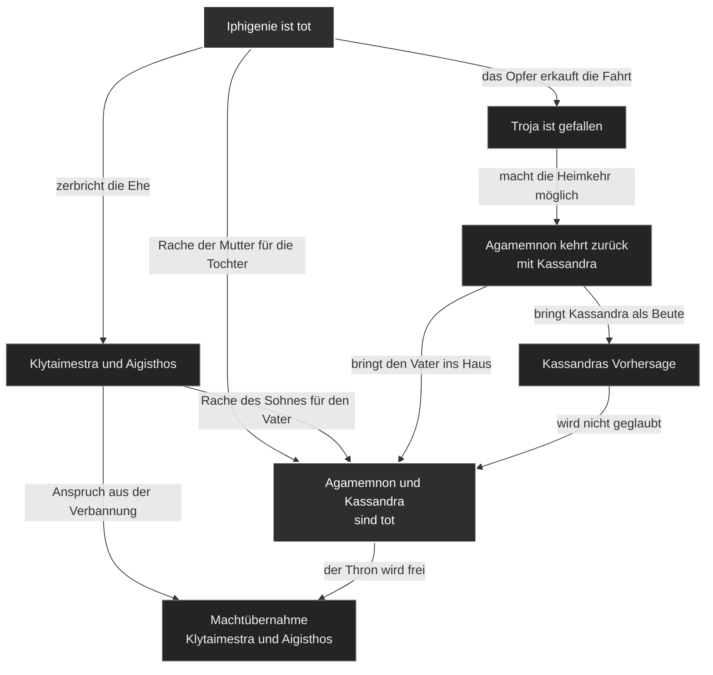

```mermaid
graph TD
    IPH["Iphigenie ist tot"]
    TRO["Troja ist gefallen"]
    AFF["Klytaimestra und Aigisthos"]
    HEIM["Agamemnon kehrt zurück<br/>mit Kassandra"]
    VOR["Kassandras Vorhersage"]
    TOD["Agamemnon und Kassandra<br/>sind tot"]
    MACHT["Machtübernahme<br/>Klytaimestra und Aigisthos"]

    IPH -->|"das Opfer erkauft die Fahrt"| TRO
    IPH -->|"zerbricht die Ehe"| AFF
    IPH -->|"Rache der Mutter für die Tochter"| TOD

    TRO -->|"macht die Heimkehr möglich"| HEIM

    AFF -->|"Rache des Sohnes für den Vater"| TOD
    AFF -->|"Anspruch aus der Verbannung"| MACHT

    HEIM -->|"bringt den Vater ins Haus"| TOD
    HEIM -->|"bringt Kassandra als Beute"| VOR

    VOR -->|"wird nicht geglaubt"| TOD

    TOD -->|"der Thron wird frei"| MACHT

    classDef ereignis fill:#242424,stroke:#888,color:#eee
    classDef zentral fill:#2e2e2e,stroke:#fff,color:#fff,stroke-width:2px
    class TRO,HEIM,VOR,AFF,MACHT ereignis
    class IPH,TOD zentral
```
