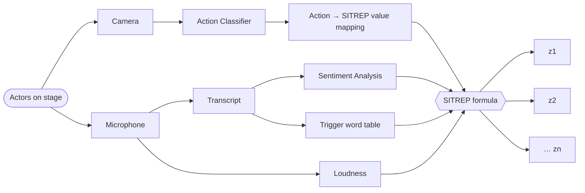

# Data Processing 

Overview: components/pipeline.md

## Affordances 

### Realtime-SITREP 
**data_in**: rehearsal stream  
**data_out**: SITREP text report, TODO  
 
- batch-process incoming video stream with Gemma-4 model 
- write SITREP report
  - who is in the scene (provide the system with images of each team member, perhaps their bio?)
  - what they are doing 
  - time frame covered
  - categories per person, 0–5:
    - **Risiko**: how dangerous a person is, e.g. punching someone, saying something threatening or dark, aggressive or radical behaviour.
    - **Menschlichkeit**: pro-social behaviour, e.g. giving someone something, helping, saying something positive.
    - Risiko and Menschlichkeit are measured from the action classifier (`src/sitrep/actions.py`) and from what each person says (`src/sitrep/speech.py`); a person's rating is the higher of the two. Loudness amplifies the Risiko evidence of both (`src/sitrep/loudness.py`).
    - **Auffälligkeit**: how far a person's behaviour deviates from their past behaviour, e.g. as a Mahalanobis distance. Until that is measured, the model rates it against the others in the window.
  - prediction of what might happen next. 
  - whether to interfere, if so, what to do. 
- prioritises low latency over accuracy 

Implementation Steps: 
1. Install Gemma-4b and deploy via Ollama
2. Set up capture loop - select video and audio source (for now we'll be testing with webcam + laptop mic)
3. Capture one frame every x seconds
4. Transcribe everything that is said, speaker diarisation eventually. 
5. Write SITREP report JSON format.
6. Every x seconds, prompt a SITREP report. X is dependent on latency - do a p95, p99 test and make sure that the system only processes as many seconds as it can keep up with. e.g. if it takes 40 seconds to process a range of 30 seconds, that will cause increasing delay. 
7. Output: video output (for testing, eventually this will be handled perhaps via TouchDesigner) and SITREP text beneath it. 

#### Calculating Values
How do we calculate the values the system comes up with? 

- *Sentiment Analysis*: feed the transcript into Gemma and ask it to score the person's values (gefahr, kollaborativ, etc.) - to do this, we need to implement speaker diarisation. Speaker attribution by lip movement of the two most visible people exists (`src/sitrep/speakers.py`); each report carries its lines with speakers (`aeusserungen`). There should also be a file with key value pairs that we can add to this analysis so that we can hardcode certain things like if sentence x is said -> set value x to y. For now the prompt's example lines (`src/sitrep/speech_examples.csv`) take this role; a separate trigger table is built only if they prove insufficient. 
- *Pose*: certain activites are recognised. For instance, people hitting each other, running, hugging, etc. and are then mapped to the SITREP values. The mapping is `src/action/sitrep_map.csv`: evidence from -5 to +5 for Risiko and Menschlichkeit per NTU120 class.
  > Claude's notes (2026-09-25), reviewed 28.09.26, kept here for now as background info:
  > - **No live WISE needed.** The pose embedding (`orest_pose`) already runs in Orest; a labelled reference corpus of a few hundred clips can be matched directly. WISE helps *build* the corpus: body-search one good example in the archive to find its rehearsed repetitions.
  > - **Label activities, not values.** Clips are tagged "Schlag", "Umarmung", …; a separate editable table maps activities to values (Schlag → gefahr ≥ 9). Same format as the key-value file for spoken lines.
  > - **Negatives are essential.** Ordinary postures barely differ in the embedding, so a large "nothing special" class is needed; an activity counts only when it clearly beats the neutral examples.
  > - **Pose catches what Gemma misses.** Gemma sees three stills per window; a slap falls between them. Pose can run continuously (~9 ms per frame).
  > - **Hitting is two bodies.** The current vector describes one body. Interactions need relational features (distance, a wrist entering the other's torso). Pretrained two-person models (NTU RGB+D) are a zero-labelling alternative.
  > - **Rule sets the floor.** A detected hit sets a minimum on gefahr in code, decaying over the following windows; Gemma is told, but can't lower it. Linking body boxes to named faces attributes it to a person.
  > - **False positives trigger Einschreiten.** Measure precision per activity; confirm high-stakes ones over two segments or with a loudness spike.
  > - **First experiment:** one activity, ~30 positive and ~100 neutral 4 s segments, nearest-neighbour separation.
- *Audio*: higher loudness increases negative-coded values like gefahr etc. Implemented as a gain on Risiko evidence from pose and speech, relative to the session's normal speaking level, which each session learns from its first 30 s of speech (`src/sitrep/loudness.py`). 

### Smart Search 
**data_in**: rehearsal corpus  
**data_out**: segments or frames, either saved or streamed directly into TouchDesigner via OSC 

This feature builds on WISE (https://github.com/ox-vgg/wise) and is an interface for searching through rehearsal footage. 

#### Wise Integration 
WISE will be used to create a multi-modal embedding of all surveillance footage. Functionality: 
- Process rehearsal footage from folder on computer 
- Feature embedding that WISE offers out of the box
- Custom retrieval pipeline
  - embodied search: 
    - body: conduct WISE search with a video segment. e.g. a 5 second video of an actor falling to their knees returns segments that match. During the performance, I should be able to press a button, then press a button again after a few seconds to capture that live sequence and then that gets used to do the retrieval. This is custom behaviour we need to figure out how to do.   
    - audio (speech): Actor says a line, line gets piped into WISE, live. e.g. Actor says "Hello World" -> WISE search returns footage where the actor said "Hello World" WISE currently cannot search for tone of voice - nice to have.   
  

#### Hindsight-SITREP 
**data_in**: time-stamped rehearsal footage  
**data_out**: time-stamped SITREP report as concise metadata 

Hindsight-SITREP runs over all the data once its recorded and writes metadata, tags, etc. and timestamps them to the corresponding clips. Create a database (e.g. SQLite) that maps metadata to corresponding footage. 

#### UI for Rehearsals & Performances
A localhost with following features: 
- Conduct WISE search via text, static image, and/or from frames from a live camera input
- Conduct Hindsight search via text
- Conduct hybrid search: select from WISE then of those select from Hindsight, or vice versa. e.g. "person running" in WISE, "is considered a threat" in Hindsight -> select top WISE results for person running, then sort those by Hindsight's threat metric 
- Results are piped into TouchDesigner  
