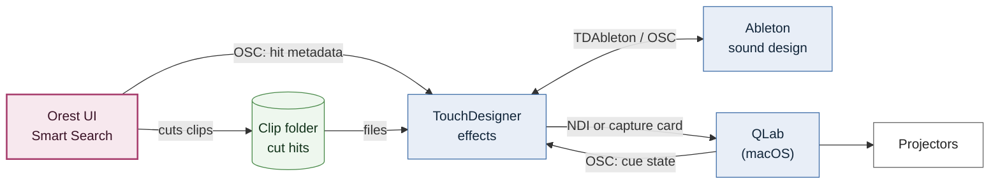

# Rendering 
Overview: pipeline.md

---

> **⚠ Written by Claude — draft, not yet reviewed by Moe (2026-09-12).**
> Everything between this box and the closing box below is a proposal drafted by
> Claude. It is not authoritative until Moe has reviewed and edited it.

## Playback chain: Orest → TouchDesigner → QLab → projectors



### Open decisions

- **Who owns the projectors.** Two workable arrangements:
  1. QLab owns the outputs (mapping, blending, cue timeline); TD's output is
     taken into QLab. Costs one extra video hop and its latency.
  2. QLab is the cue master only, sending OSC to TD and Ableton, and TD drives
     the projectors directly.

  To be settled with the video department before the interface is built.
- **Crossing machines.** QLab runs on macOS only; Orest and TD run on Windows.
  TD's output reaches QLab over NDI or through a capture card (Syphon works
  only within one Mac). Which inputs QLab accepts depends on its version and
  must be checked.
- **TD ↔ Ableton.** TDAbleton (Derivative's official bridge, via Max for Live),
  plain OSC/MIDI, or Ableton Link for tempo. No Orest involvement.

## Interface: Orest → TouchDesigner

OSC carries messages, not pixels. The interface therefore has two channels.

### Pixels: cut clips on disk

A WISE hit is a time range inside a source recording that may be several GB
(e.g. Othello 2022, 4.3 GB). Seeking inside long-GOP H.264 or 4K files is slow
and unreliable in playback, so Orest cuts each hit into a short clip in a
playback-friendly codec, writes it to a shared clip folder, and TD plays the
file. This is the `HITS → CUT` node of the RENDER graph in
`source_of_truth/pipeline.md`.

For live frames rather than stored footage, the equivalent channel is Spout
(same machine) or NDI (across machines).

Clip cutting is decode-bound and costs about four times as much for 4K sources
(`changelog.md`, 2026-09-11). Clips are cut in rank order and each hit is
announced once its clip exists, so rank 1 is playable first.

### Control: OSC

```
/orest/results/begin  <query_id> <count>
/orest/results/hit    <query_id> <rank> <clip_path> <ts> <te> <score> <source_file> <preroll>
/orest/results/end    <query_id>
```

TD collects the hits of one `query_id` into a Table DAT. The fields follow
`Hit` in `src/smartsearch/client.py`. A return channel from TD (e.g.
`/orest/query ...`) allows a QLab cue to trigger a search.

## How many results reach the stage

**Orest sends a fixed maximum; TD/QLab chooses how many to use, per cue.**

- The number of clips a scene uses is a playback parameter, like opacity or
  timing. Stored in a QLab cue (as OSC to TD), it is recalled identically every
  performance; a dial in the search UI must be reset by hand each scene.
- The result list is ranked, so the top 5 are the first 5 of the top 20.
  Changing the count mid-scene needs no new search.
- The UI holds only the maximum, which also bounds clip-cutting work.

Division of responsibility:

| Orest (Smart Search) | TouchDesigner / QLab |
|---|---|
| Which moments are good results: ranking, per-file caps, excluding the recent past (`progress_tracker.md`, Phase 3) | How many are used and how, per cue |
| Maximum number of results sent | Count, order, effects, timing |

### Score threshold as an alternative to a fixed count

On the full pose index (`changelog.md`, 2026-09-11), a distinctive movement
returns one clear winner with a margin of 0.25–0.33 over the next result, while
an ordinary stage posture returns six results within 0.011 of each other. A
fixed count yields near-identical clips in the second case; a rule such as
"keep results within X of the best score" adapts to both. Scores are not
comparable across indices (SigLIP text/image search ~88, pose ~0.97), so a
threshold is set per index.

> **⚠ End of Claude-written section.**
