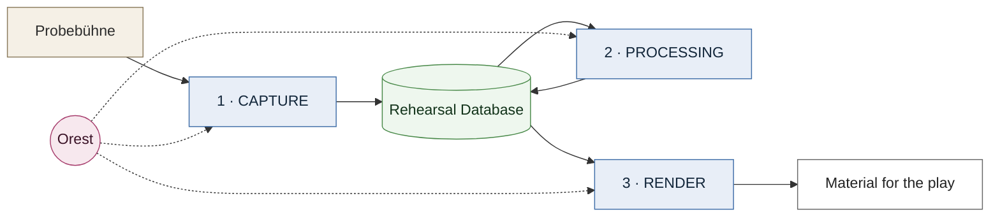
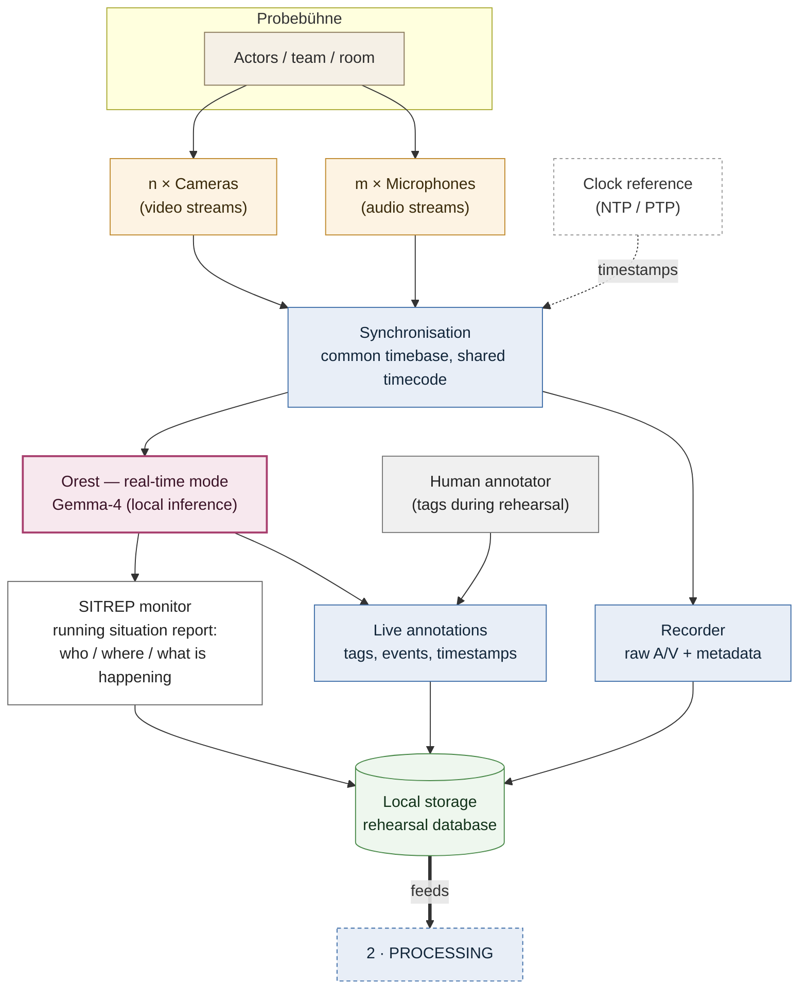
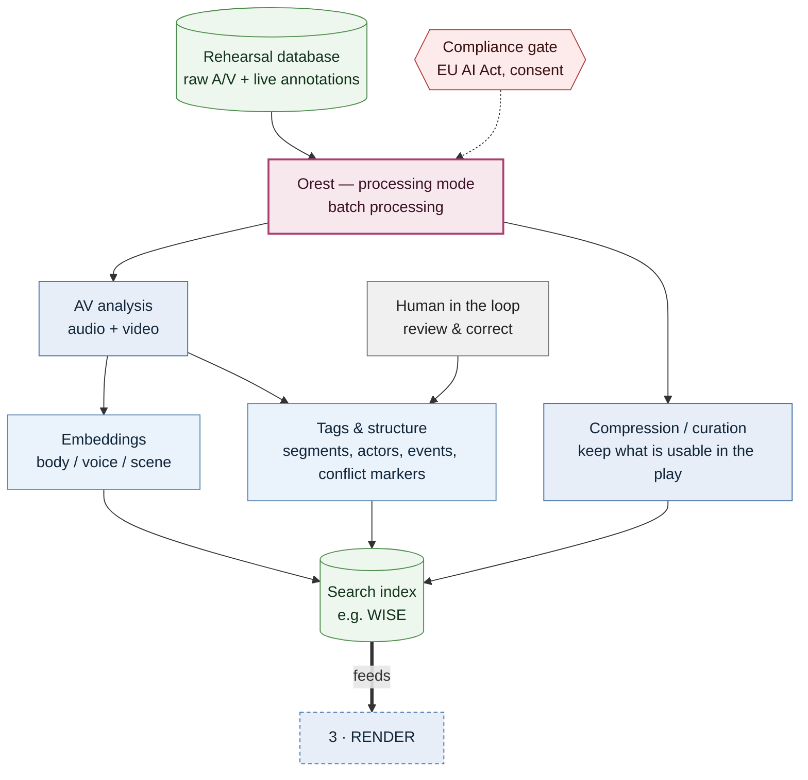
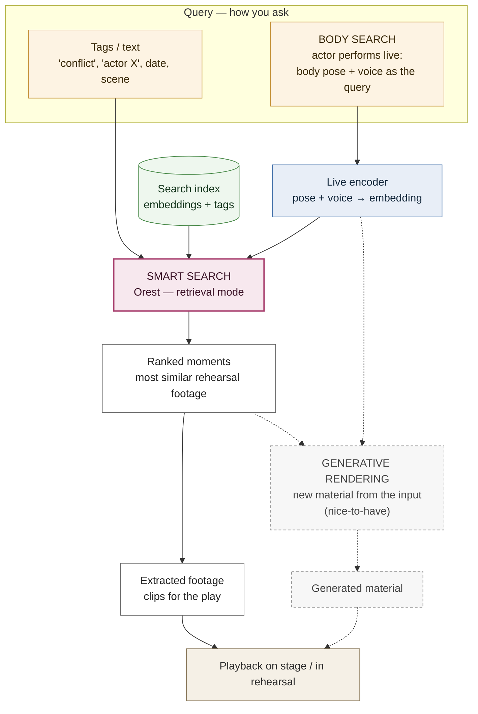

# Orest - Pipeline

Orest runs in three modes across the pipeline: **real-time** (capture), **offline** (processing) and **retrieval/generative** (render).

## [CAPTURE](capture.md)
Data capturing of rehearsals follows the AMAP principle: collect as much data as possible. 

### Hardware
- Microphones (ASK Tonkids)
- Cameras (ASK Nils)
  
### Software
- [#TODO]: what is the most effective way of recording all this data in sync? 
- [#TODO]: file naming standard
- [#TODO]: database structure
- [#TODO]: Perhaps a tool that allows a human to annotate exact timestamps with a tag during rehearsal? 

### Anticipating Issues
- capturing third-party individuals? e.g. technicians, AMA, etc. -> perhaps one full-room setup, one stage setup that we can easily switch between
- explicit team-consent?

## [PROCESSING](processing.md)
Process the rehearsal data to gather intelligence on the room + its activities & participants

### Hardware
- PC to run local inference on 

### Software
- "smart" database existing between capture & processing. Features: annotation during collection, smart search. perhaps use this: [WISE](https://gitlab.com/vgg/wise/wise)
- profile actors (+ team?)
- compress data, optimising for footage to be used in the play. Current topic focus: teaching the AI to learn how to deal with conflicts by observing human conflict. 
- 

### Anticipating Issues 
- EU AI Act for stuff like face & emotion recognition etc. 

## [RENDER](render.md)
Get material back out of the database — by tag, by body, or by generating something new.

